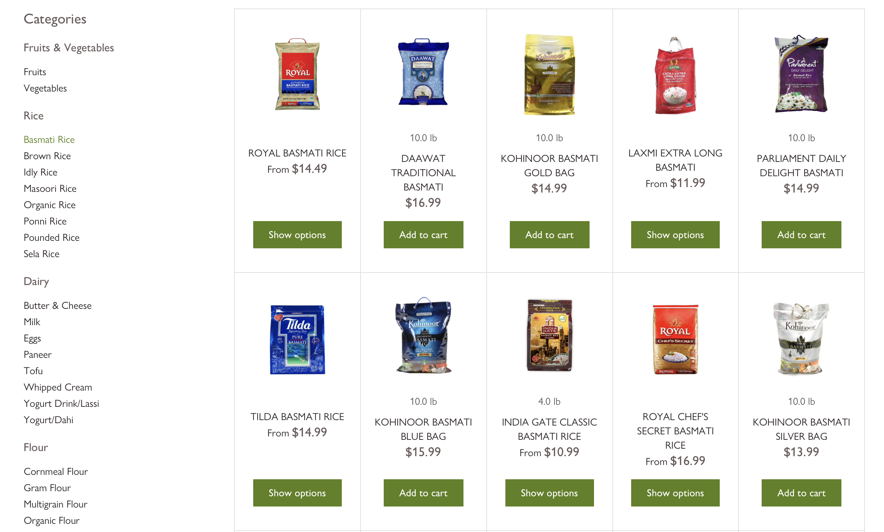
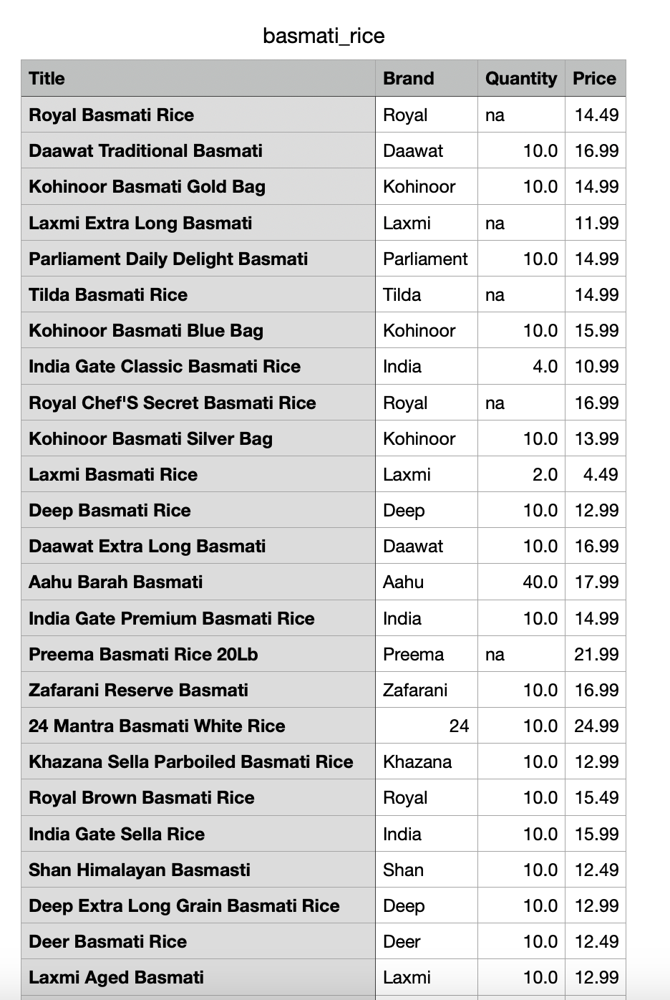

# Grocery Web Scraper

##How to Run:
1. Install Python3
2. Pip install beautifulsoup

Scrapes https://newindiansupermarket.com for:
* Item Name
* Item Brand
* Item Price
* Item Quantity

Stores the fields into a CSV file.

